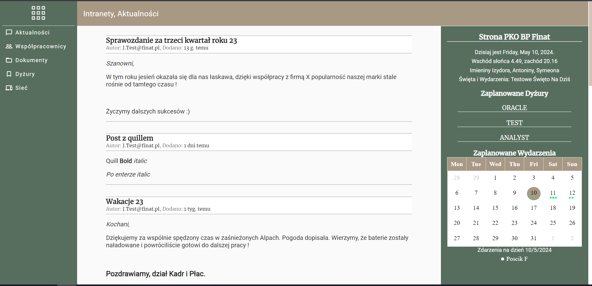
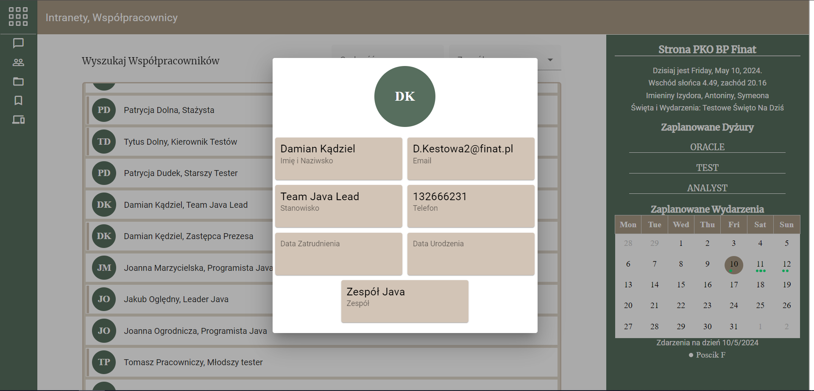
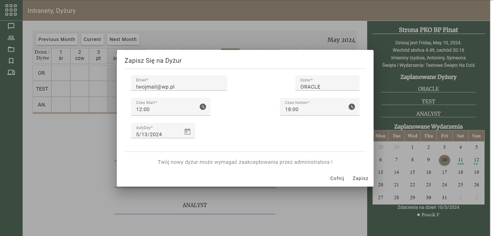
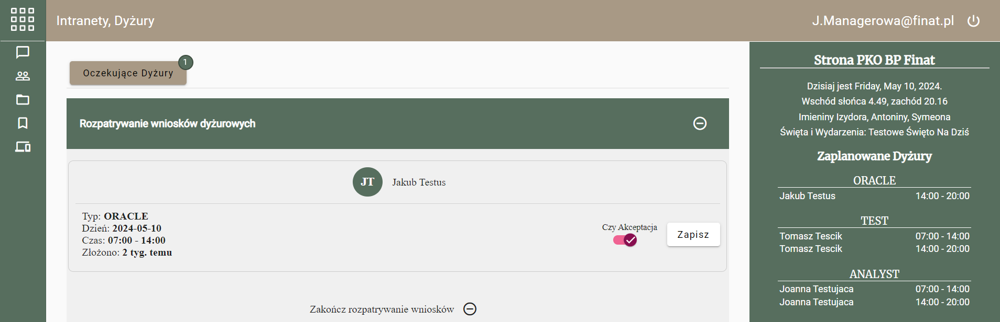
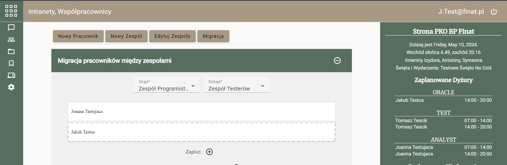
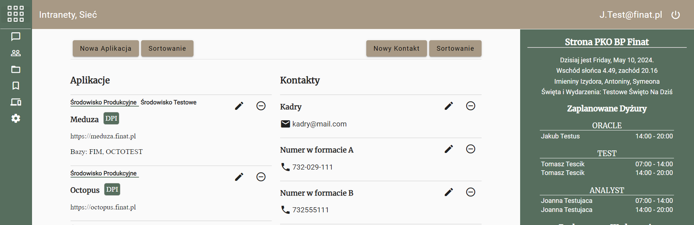
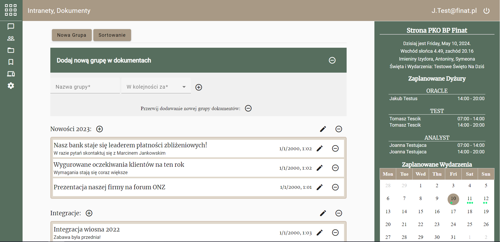
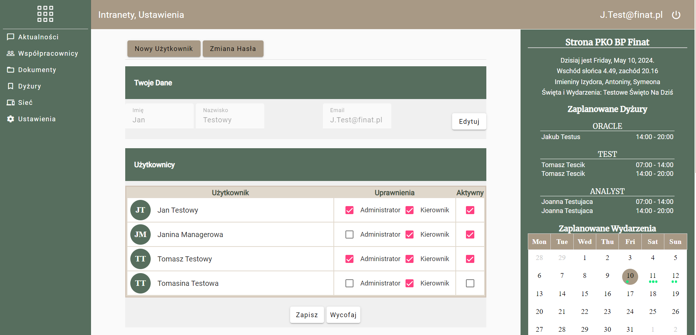
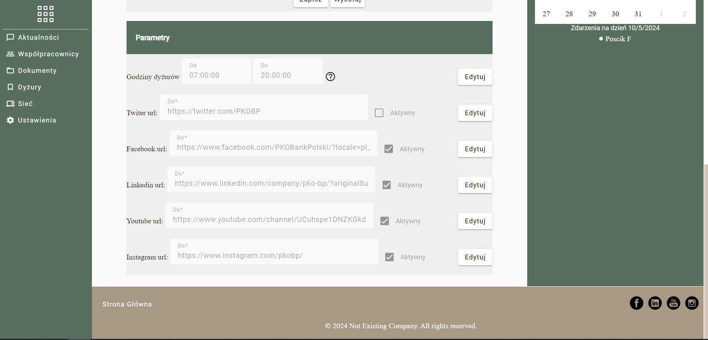

# IntranetApp
This project was generated with [Angular CLI](https://github.com/angular/angular-cli) version 16.2.3.

# functionalities
## Not logged user
Display, serach for news in company: posts, events, contacts, employees, documents:

and registration of on-call duty:

## Logged Manager
Not logged user functionalities plus approve duties:

## Logged administrator
Not logged user functionalities plus modify posts, events, contacts, employees, documents:

This user has access to admin pannel:

Backend code is set as private. Intereted ? Lets contact :)